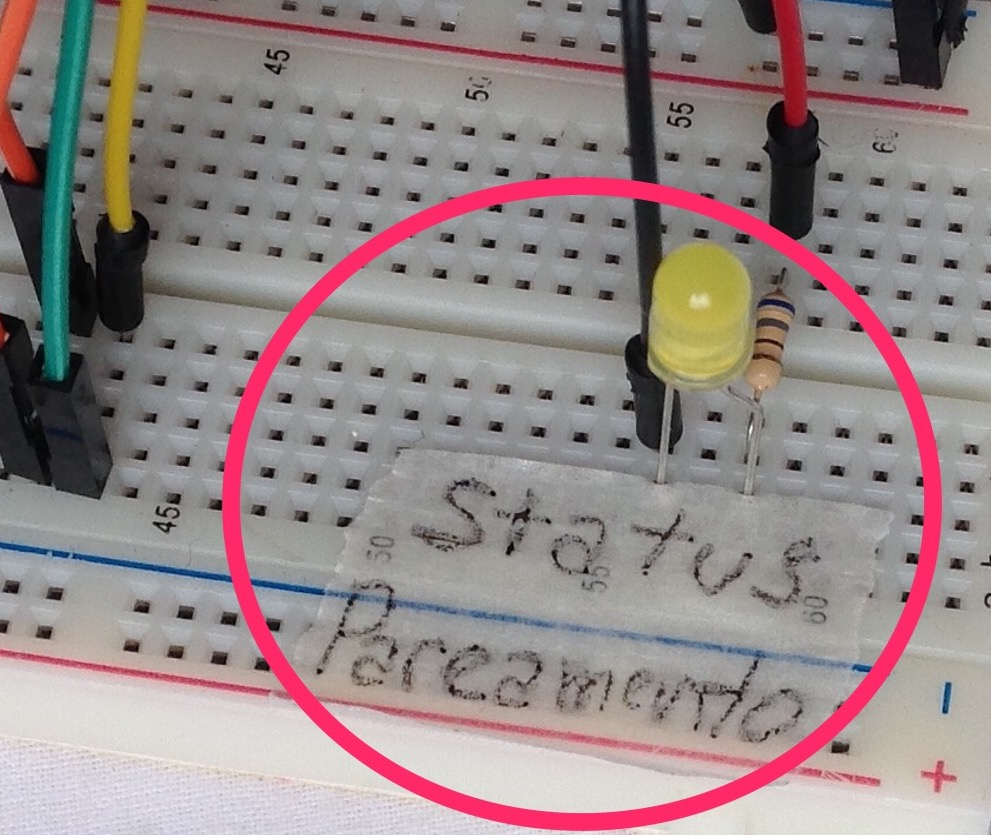

###### Escola: FIAP
###### Curso: MBA FULLSTACK DEVELOPER, MICROSERVICES, CLOUD & IoT
###### Disciplina: IoT Development
###### Aluno / RM: JEAN BRUNO SOUTO VILLETE / 335435


```
Objetivo principal: O trabalho consiste na entrega de uma solução IoT completa.

Detalhe da entrega: entregar a descrição do projeto textual ou em vídeo (pode subir o vídeo
    no YouTube, deixar como não listado e enviar o link). Além da descrição, imagens 
    ilustrativas e snippets de código que demonstrem a integração dos componentes 
    são requeridas. 

Por ex: uma solução que integra um sensor de temperatura a uma nuvem do Google com Firebase.
    Nesta caso, imagens do circuito montada da placa, sensores e atuadores, trechos de
    código que mostrem como foi feita a integração da placa com Fog e/ou Cloud computing. 
```

# 1 - solução proposta

O trabalho proposto é a interação entre um componente físico (sensor) plugado no arduino, e um serviço remoto,
gerido em uma plataforma como AWS, Azure ou Google Cloud Platform.

Por fim, dado os componentes que eu tinha em mãos e o meu conhecimento em cloud, o resultado foi basicamente
utilizar um sensor ultrasonico de presença (HC-SR04), e comunicar com um serviço WebSocket hospedado na 
AWS, em que me mostrasse a distância calculada pelo sensor em tempo real, através de uma página web.

Mas além de mostrar que meu sensor se comunicava devidamente, eu decidi implementar o registro do meu device
(conjunto de componentes físicos) associando a um usuário, a mensagem gerada pelo sensor fosse disparada
apenas para os usuários remotos de fato interessado.
Esta segunda parte é um **plus** no trabalho, pois mostra além da comunicação mínima do componente/sensor
com a internet, mas também uma **inteligência no pareamento** entre o físico e o serviço remoto na internet.

# 2 - visão geral; interface

Imagem panorâmica do circuito;


--

Quando a placa é energizada, todos os componentes e sensores ficam desligados, i.e; leds e 
sensor ultrasonico de distância.

Na **bread board**, na extrema esquerda, há um push button;


--

Quando este push button é pressionado, é feito uma requisição solicitando um código de pareamento.

    Toda comunicação com a placa Arduino e o mundo externo/remoto, é feita utilizando
    a porta serial (SERIAL_BAUDS 9600).

Este código de pareamento é registrado remotamente no banco DynamoDB na AWS, que posteriormente
será pareado com um cliente remoto acessando a página web (para comunicação websocket).

O código de pareamento é formado por 4 dígitos que vão de 1 a 4, e.g; 1234, 2244, 4121, etc.

    Este requisito do código de pareamento, é basicamente porque eu não tenho um  display
    para apresentar o código, e como eu tenho apenas leds, eu utilizei 4 leds (**dígitos de
    1 a 4**) que ascendem e desligam em uma ordem que apresentam os 4 dígitos (cada dígito
    por vez).

Quando um código de pareamento é recepcionado pela placa, este código é apresentado através dos
leds responsáveis;


--

Uma vez que o usuário consiga obter este código de pareamento, o usuário deve acessar página web com capacidade de comunicar/parear/recepcionar mensagens, se conectar ao websocket e por ultimo submeter o código de pareamento;


--

Assim que for submetido o código de pareamento, é disparado uma mensagem para o disposivo
(placa Arduino) informando do evento de pareamento, e a partir deste momento, o led do status
de pareamento é ligado, e o sensor ultrasonico de distância começa a observar o ambiente e disparar
a distância do corpo mais próximo a cada **500 milissegundos**;



--