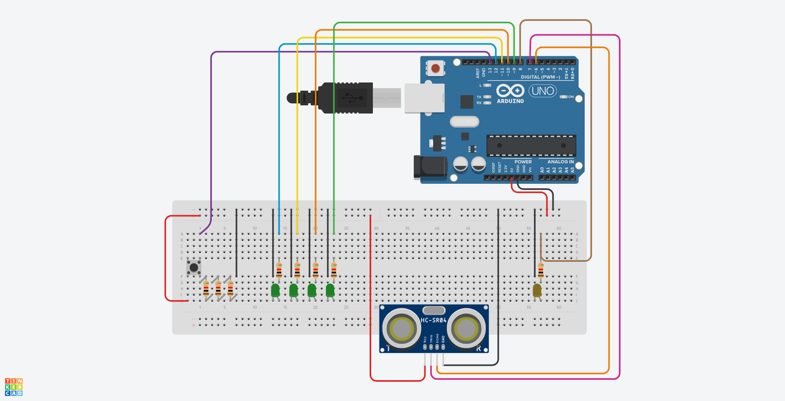

## 1 - Arduino

O código C++ do projeto está disponível no diretório **Main**, que guarda todos componentes/classes
e suas nuances implementadas.

O código está devidamente modulado, onde cada componente físico é representado por uma classe
com seus devidos comportamentos mapeados, o que quer dizer que se componentes físicos do mesmo
tipo forem adicionados, apenas novas instâncias devem ser obtidas.

## 2 - esquema do circuito

Sobre o circuito, e os componentes utilizados, seguem declarados na imagem abaixo,
que foi desenvolvida via ferramenta [tinkercad](www.tinkercad.com);



--

## 3 - sensor ultrasonico hc-sr04

Para o sensor ultrasonico de distância, foi utilizado a biblioteca [Ultrasonic](https://github.com/filipeflop/Ultrasonic)
mantida no repositório do [github filipeflop/Ultrasonic](https://github.com/filipeflop/Ultrasonic)
que auxilia na codificação e utilização do mesmo.

Para utilizar a biblioteca, basta fazer checkout do repositório, e importar a biblioteca para
dentro da IDE Arduino.

## 4 - (opcional) cheat sheet; comandos no linux

Como eu utilizo um host/estação linux, para conseguir interagir com a placa Arduino, eu
tive que disparar alguns comandos para descobrir e então liberar a utilização do device (/dev/...)
mapeado, e outras necessidades semelhantes, para isto, eu mapeei o seguinte **cheat sheet**;

```
---

# before plugin the usb cable connected with arduino board, ensure there's no file/directory
#   with name to be used/assigned
# in other words, in case the assigned device name is /dev/ttyACM0 (through dmesg command),
#   delete/remove the file/directory in case it exists before plugin the usb cable.

---

# check for kernel messages, and print the device being used when the usb is hooked up
$ sudo dmesg -wH

---

# enables arduino process to upload content to  the device, with no need to start arduino
#   process with root privileges
$ sudo chmod a+rw /dev/ttyACM0

---

# enables communication with serial through tty commands
# NOTE: the value 9600 is the value associated on program, i.e; Serial.begin(9600);
$ stty -F /dev/ttyACM0 cs8 9600 \
    ignbrk -brkint \
        -imaxbel \
        -opost \
        -onlcr \
        -isig \
        -icanon \
        -iexten \
        -echo \
        -echoe \
        -echok \
        -echoctl \
        -echoke 
    noflsh -ixon \
        -crtscts

---

# print content to serial port
$ echo -n s > /dev/ttyACM0

---

# read content from serial port
$ cat < /dev/ttyACM0
```

## 5 - IDE Arduino; deploy na placa

Uma vez com o circuito montado, com os componentes devidamente mapeados em suas respectivas
portas, e o código carregado na IDE Arduino, faça upload do código para a placa.